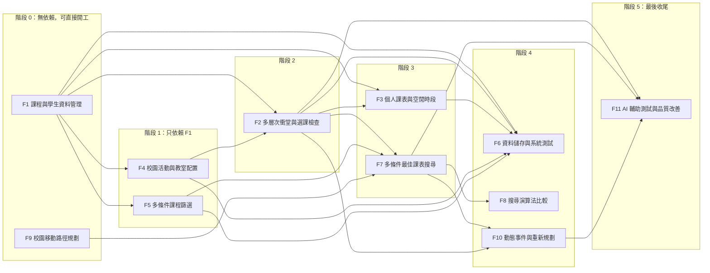
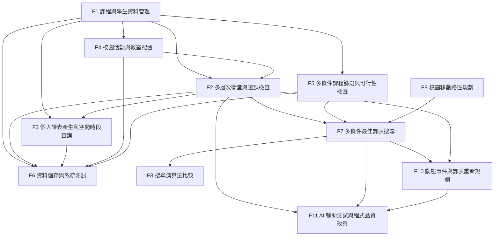
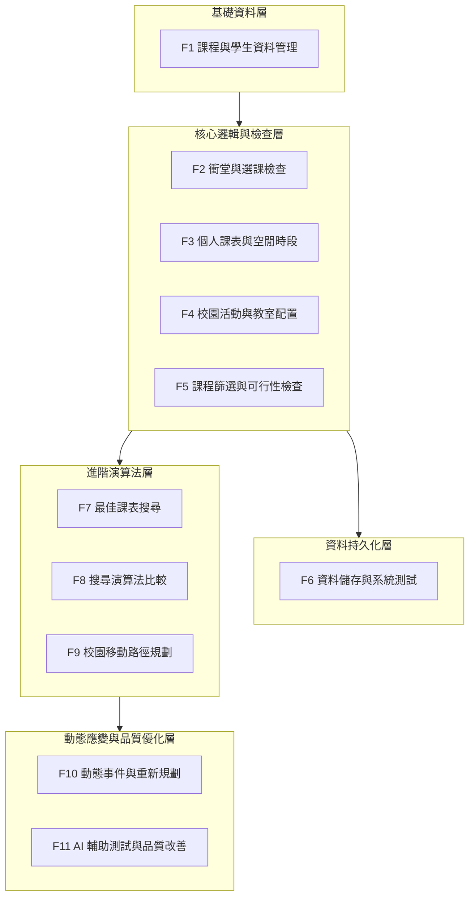
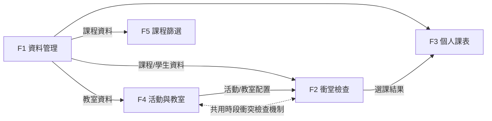
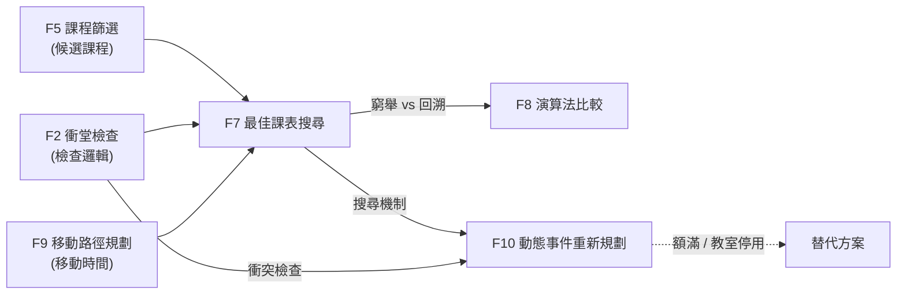
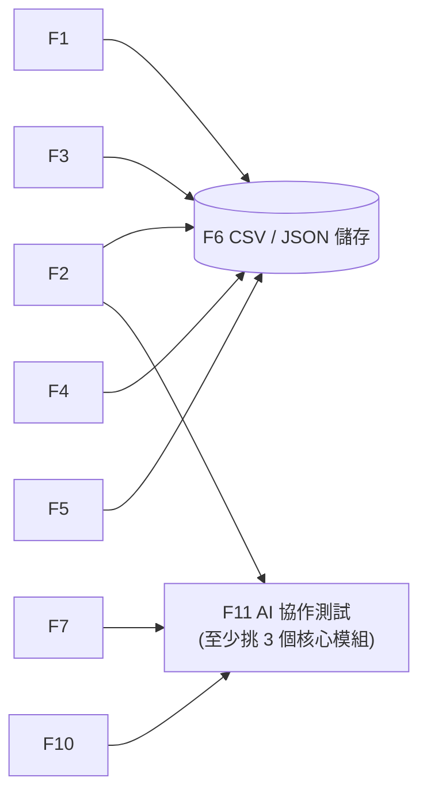

# 依賴關係

- **實線箭頭**：資料或邏輯依賴，A → B 代表 B 依賴 A。
- **虛線**：共用機制或情境觸發，非直接資料傳遞。
- F11的圖中，先以F2、F7、F10作為示範的三個核心模組，可替換。

## 1. 整體依賴關係總覽

圖 1-A 說明：開發順序依賴圖

- 依「開發順序」由左至右排列，最左邊是不需等待任何模組、可直接開工的起點，後面依序接上依賴它們的模組。
- 階段 0：F1（課程與學生資料管理）與 F9（校園移動路徑規劃）無前置依賴，可同時開工。
- 階段 1：F4（活動與教室配置）與 F5（課程篩選）只依賴 F1。
- 階段 2：F2（衝堂與選課檢查）需要 F1 的課程與學生資料，以及 F4 的活動與教室配置。
- 階段 3：F3（個人課表）依賴 F1、F2；F7（最佳課表搜尋）依賴 F2、F5、F9。
- 階段 4：F6（資料儲存）需等 F1～F5 完成；F8（演算法比較）與 F10（動態重新規劃）依賴 F7，F10 另依賴 F2。
- 階段 5：F11（AI 輔助測試與品質改善）最後進行，需有已完成的核心模組可供測試。

圖 1-B 說明：整體依賴關係總覽

- 以由上而下的流程圖呈現 F1～F11 全部模組的依賴關係，箭頭 A → B 代表 B 依賴 A。
- F1 是資料基礎，向下連到 F2、F3、F4、F5、F6。
- F4 提供活動與教室配置給 F2；F2 的選課結果再提供給 F3。
- F2、F5、F9 共同匯入 F7；F7 再往下連到 F8 與 F10。
- F6 彙整 F1～F5 的資料進行儲存。
- F11 以 F2、F7、F10 為示範的三個核心模組進行 AI 協作測試，實際可替換。

## 2. 分層架構圖

圖 2 說明：分層架構圖

- 將系統分為五層，由上而下為底層到上層的依賴方向。
- 基礎資料層：F1，是整個系統的資料起點。
- 核心邏輯與檢查層：F2、F3、F4、F5，負責衝堂檢查、課表產生、活動教室配置與課程篩選。
- 資料持久化層：F6，將業務資料儲存為 CSV 或 JSON。
- 進階演算法層：F7、F8、F9，負責最佳課表搜尋、演算法比較與移動路徑規劃。
- 動態應變與品質優化層：F10、F11，負責事件發生時的重新規劃，以及 AI 輔助測試與程式品質改善。
- 層與層之間的箭頭代表上層依賴下層的成果。

## 3. 核心邏輯層細部依賴

圖 3 說明：核心邏輯層細部依賴

- 聚焦在 F1～F5 之間的資料流向。
- F1 提供課程與學生資料給 F2，提供教室資料給 F4，提供課程資料給 F5，也提供資料給 F3。
- F4 提供活動與教室配置給 F2。
- F2 提供選課結果給 F3，用來產生每週二維課表。
- F2 與 F4 之間的虛線雙向箭頭，代表兩者共用同一套時段衝突檢查機制，並非直接資料傳遞。

## 4. 進階演算法層與動態應變

圖 4 說明：進階演算法層與動態應變

- F7（最佳課表搜尋）整合三項輸入：F5 的候選課程、F2 的衝堂檢查邏輯、F9 的校園移動時間。
- F7 的搜尋結果延伸出兩條路線：
  1. F8：實作窮舉搜尋與回溯搜尋，比較效能與結果一致性。
  2. F10：當模擬事件（課程額滿、教室停用）發生時，結合 F7 的搜尋機制與 F2 的衝突檢查，重新規劃並產生替代方案。
- 虛線代表情境觸發，而非直接資料傳遞。

## 5. 資料持久化與品質改善

圖 5 說明：資料持久化與品質改善

- 左半部：F1～F5 產生的課程、學生、教室、活動與選課紀錄，統一由 F6 儲存為 CSV 或 JSON 檔案。
- 右半部：F11 針對已完成的核心模組進行 AI 協作測試與程式品質改善，至少挑選三個模組。
- 圖中以 F2、F7、F10 作為示範，實際可依專案進度替換。

