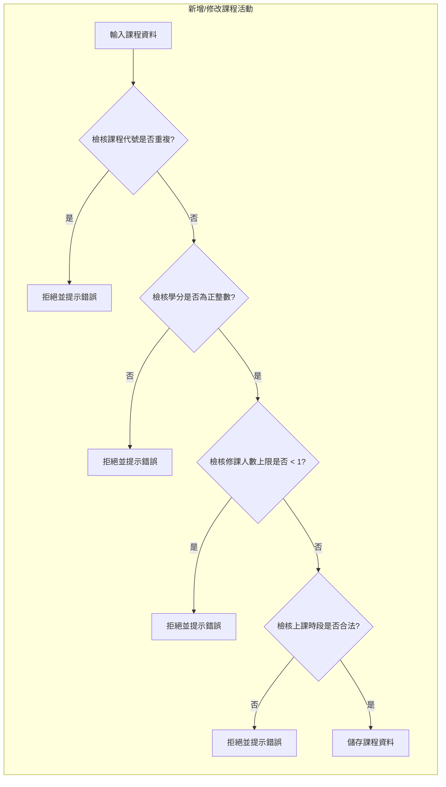
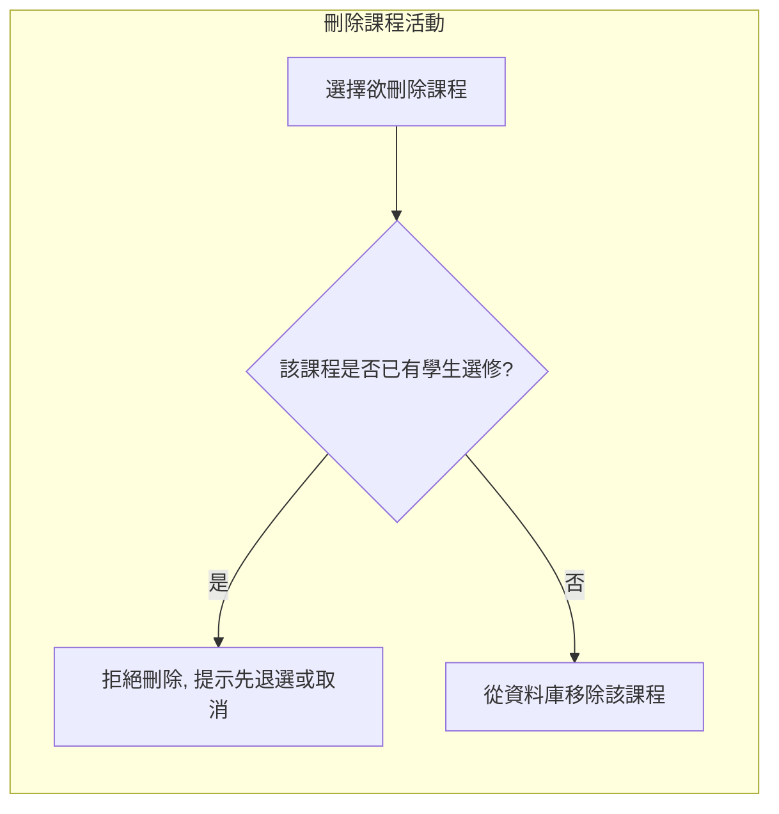

# F1 課程與學生資料管理

## 活動一：新增 / 修改課程  

- **輸入資料：** 課程代號、名稱、學分、必選修、授課教師、修課人數上限、教室、每週上課時段。  
- **系統檢核機制：**  
  - 判斷：課程代號是否已存在？ (是 -> 報錯拒絕 / 否 -> 繼續)  
  - 判斷：學分是否為正整數 (>0)？ (否 -> 報錯拒絕 / 是 -> 繼續)  
  - 判斷：修課人數上限是否大於等於 1？ (否 -> 報錯拒絕 / 是 -> 繼續)  
  - 判斷：時段格式是否正確 (星期1-7, 節次1-9, a, b, c)？ (否 -> 報錯拒絕 / 是 -> 繼續)  
- **完成作業：** 寫入資料庫，回報成功。  

## 活動二：刪除課程  

- **選擇目標：** 選擇欲刪除的課程。  
- **防呆檢核：**  
  - 判斷：是否有學生已選修此課？  
    - 若有 -> 拒絕刪除 (提示：請先執行退選或課程取消)。  
    - 若無 -> 允許刪除。  
- **完成作業：** 執行資料刪除，回報成功。  

---

## 流程圖  

- **新增/修改課程活動：**

- **刪除課程活動：**

